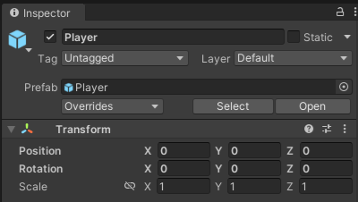

# COMP2160 Prac 01: Introduction to Game Development

>## Discussion: Your values as a game developer
>Fresh out of University, you and some other graduates decide to make a game together in the hopes of adding to your portfolios and getting some more experience. At your first meeting, you discuss what values you all want to uphold when working together, and what they mean for you individually. 
>
>You recall the [ACS Code of Professional Ethics](https://www.acs.org.au/content/dam/acs/rules-and-regulations/CodeOfProfessionalEthics_Mar_2023.pdf) and the values of honesty, trustworthiness and respect for both the individual and the profession. How do you articulate what these values mean to you, and how you will uphold them as a game developer?

## Topics covered:
- Event-based programming
- Intro to Vectors
- Architecture & Version Control

## Welcome and Github/Unity refresher
In these sheets, you'll find the exercises you must complete each week to earn a mark. If at any point you get stuck, don't forget to read the read the [Unity Scripting Reference](https://docs.unity3d.com/ScriptReference/). We will not be explaining what everything does. It is up to you to get used to reading the API reference yourself.

### Linking your Student ID
If you've made it this far, you've already used the Github Classroom link on iLearn. But did you link your Student ID to your Github account? If not, you'll need to make sure you do that next time, as this information is used for marking your assignments.

If your student ID wasn't on the list, please send an email to cameron.edmond@mq.edu.au with your student ID so it can be added to the roster. You'll be able to link your account next prac.

### Brushing up on Git
We will not go into detail about cloning projects using Github, as you have covered this previously. If you need a refresher, we've provided Github's short course on [Git and Github Fundamentals](https://classroom.github.com/a/TQ86t74s).

### Opening the Project
Clone the repository onto your computer using the Git client of your choice. Remember that this unit's Unity projects are contained **inside** the repository, rather than repository itself. Open this up in Unity, making sure you are using [2022.3.37f1](https://unity.com/releases/editor/whats-new/2022.3.37).

Let's review the Unity interface. Here is an image of the default Unity layout:


1. The heirarchy, which displays all objects in the loaded scene.
2. The scene view, which displays the loaded scene spatially. The Game view can also be accessed here using the tabs along the top of the window.
3. The inspector, which displays the current information of the selected object or asset.
4. The project panel, which shows the file contents of your project (predominently the assets and packages). The console window can be selected here using the tabs along the top of the window.

As a developer, it's a good idea to monitor the console window, so you can keep track of any debug statements or errors that pop up. To move a particular window, click-and-drag on it's name and release when you are happy. I like to keep my console log under my Inspector:


## Reading and Writing Code
### Familiarising yourself with the code
You'll notice two particular folders in the Project panel: **Player** and **Waypoints**. Inside each folder is a Prefab GameObject, and a corresponding C# script that extends the `Monobehaviour` class. 

Go ahead and open up both the `PlayerMovement` and `Waypoint` scripts. You can also take this time to get familiar with your code editor of choice. I'll be using [Visual Studio Code](https://code.visualstudio.com/) throughout these pracs and in my lectures.

Before we read the code, let's try running the game. The player is represented by a yellow Hexagon, and the Waypoints as purple circles. Clicking a circle will start moving the player towards the circle. Play around with this for a little bit, then get ready to explore the code.

### Event-based programming
As stated in the lectures, our emphasis is on **Event-based programming**. When external events (such as player input) occur, the game state updates accordingly. Take a look at `PlayerMovement` and `Waypoint` and identify:
* What is the external event that is read by the game state? Where is it read?
* What happens when it is read? What is updated directly, and how does this effect what happens in game?

Write down your answers. You are free to discuss this with the person next to you.

### Code Architecture: Variables and Access
Good code architecture is important in game development, as we often have many different objects interacting. See if you can identify where the below categories of values are in the code, and why they've been defined as such. Review the lecture slides if you're stuck on definitions:
* Private Fields
* Serialized Fields
* Properties

Write down which variables you think are which.

### Intro to Vectors
Vectors are the bread-and-butter of game development. In this unit, specifically `Vector3`. A Vector3 is a data structure of three floats, typically represented as x,y and z values. We use these values to represent points, directions, movement, scales and more. We will dive into these in Week 2.

The first component listed in the inspector of an object is the `Transform` component. The `Transform` shows three Vector3s: Position, Rotation and Scale. Today, we will focus on Position.

Select the Player object in the Heirarchy, then press play. Observe its Position in the Inspector when you click on a Waypoint. Return to the scripts and trace why this is happening before moving on.



### Working with the console
The `PlayerMovement` script is altering the Player's position each frame in the `Update()` method:

```
transform.position = Vector3.MoveTowards(transform.position, target, moveSpeed * Time.deltaTime);
```

The value `target` is being updated to whatever Waypoint has been clicked. 

The other values of note are `moveSpeed` and `Time.deltaTime`. `moveSpeed` can be set in the inspector; try changing its value. To better understand `Time.deltaTime` write its value to the Debug log each frame by adding the following code to `PlayerMovement`'s Update() method:

```
Debug.Log("deltaTime = " + Time.deltaTime);
```

`Time.deltaTime` returns the interval between the last and current frames. It helps us make our games framerate indepedent, so they run consistently across different devices. You can learn more about Time.deltaTime by reading [the documentation](https://docs.unity3d.com/ScriptReference/Time-deltaTime.html).

Write the targeted Waypoint's position to the console. In the `Waypoint` script, add a `Debug.Log()` call to the `OnMouseDown()` method. Using the information above, figure out what you need to pass to `Debug.Log()`. Ask your demonstrator for hints if you get stuck. Note: You'll want to comment out the delatTime debug message at this point.

### Modifying movement
The `PlayerMovement` script uses the Vector3 method `MoveTowards()` to change the player's position over time to that of its target. However, this is only one approach. 

Open up the [Vector3 Scripting Reference](https://docs.unity3d.com/ScriptReference/Vector3.html) and take a look at some of the other methods, especially `Lerp()`, `Slerp()` and `RotateTowards()`. 

Replace the `MoveTowards()` function in `PlayerMovement` with another method. You may need to modify `moveSpeed`, or change the paramaters you are passing in.

Try placing a minus sign (-) in front of the target paramater. How does this change player behaviour? Why?

### Component-Based Development
In Unity (and many commercial game engines), we approach our development as component-based. All GameObjects contain components that provide functionality. You've already been working with the `Transform` component, and the `PlayerMovement` and `Waypoint` components. We're now going to modify the `SpriteRenderer` component on our Waypoint Prefab.

#### Accessing the component
When we want to access a component on an object, we need to add it as a variable. In the `Waypoint` script, declare a new variable of type `SpriteRenderer`. Give it a meaningful name and set its protection level (Does it need to be a SerializeField?). I'm calling mine "sprite".

We need to Instantiate our new variable, and make it a reference to the actual SpriteRenderer component on our object. Add the following above the `Start()` method:

```
void Awake()
{
    sprite = GetComponent<SpriteRenderer>();
}
```
 It's a good habit to have an Object instantiate all its own internal variables before it begins dealing with any others (and before any other objects deal with it!). Using `Awake()` isntead of `Start()` ensures this. You can read more about this [here](https://docs.unity3d.com/ScriptReference/MonoBehaviour.Awake.html).

The `GetComponent<>()` method gets the SpriteRenderer component attached to this object. If there isn't one, this will return null.

#### Understanding the component
Our goal is to have the Waypoint switch to a different color when clicked on, and then change back to the default color when the mouse is released.

Take some time to understand the `SpriteRenderer` component. Your task now is to read through [the documentation](https://docs.unity3d.com/Manual/class-SpriteRenderer.html), and find the variable you'll need to change to achieve our goal.

Here's what it looks like in the inspector:


#### Last steps (Adding an event)
We'll need two `Color` variables, one for the default color, and one for the clicked color. Add these to the Waypoint script. Make them exposed in the inspector for easy-editing.

Using your knowledge from reading the documentation, add a new line of code in the `OnMouseDown()` method to change the Sprite Renderer's color to the clicked color.

Finally, we want to change the color back. In addition to `OnMouseDown()`, there is also an `OnMouseUp()` method. Add this method to your Waypoint code, and write code to change the color back to the default. Where else should you be setting the color to default?

### Marks for today
To receive a mark, show your demonstrator:

* Your notes on event based programming and the different variables used in this code.
* Your console, printing both deltaTime and the target's position.
* How you modified player movement.
* The waypoints changing colour.